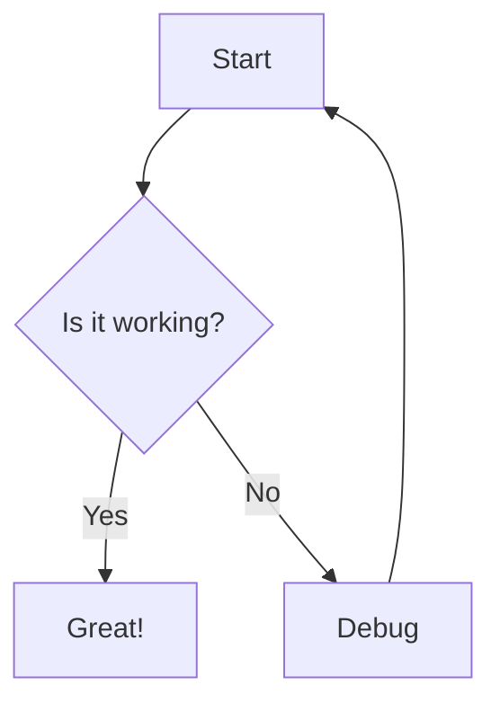

# Markview

A modern desktop Markdown editor and vault manager for macOS and Windows. Built with **Tauri v2 + React + TypeScript + Tailwind CSS**.

## Features

### Core Editing
- 🗂️ **Vault Mode** — Open any folder as your markdown workspace
- 🗂️ **Multi-Tab** — Open multiple files in tabs with unsaved-change indicators
- ✂️ **Markdown Toolbar** — Bold, italic, headings, lists, links, code, tables, and Mermaid diagrams
- ✂️ **Source / Split / Preview** — Toggle between raw markdown, side-by-side, and full preview
- 📝 **Inline Preview** — Click any paragraph, heading, or list in preview to jump directly to its source
- 📄 **PDF Export** — Print-ready export via the browser print dialog

### Navigation
- 📁 **Folder Tree** — Recursive collapsible sidebar with file navigation
- ⚡ **Quick Switcher** — `Cmd+P` fuzzy file search across the vault
- 🔍 **Vault Search** — `Cmd+Shift+F` full-text search across all notes (content + filenames)
- 🔗 **WikiLinks** — Obsidian-style `[[Note Name]]` internal links that open the target file
- 🌙 **Dark Mode** — Light, dark, or system theme with settings persistence

### Markdown Extensions
- 🧮 **Math (KaTeX)** — Inline `$...$` and block `$$...$$` LaTeX math rendering
- 📊 **Diagrams (Mermaid)** — Flowcharts, sequence diagrams, and more via code blocks
- 🖼️ **Local Images** — Relative image paths resolved against the current note
- 🌐 **External Links** — Standard `[text](url)` and autolinking

### Productivity
- ⚙️ **Settings** — Editor font size, line height, theme preferences (persisted to disk)
- 📂 **Session Restore** — Remembers open tabs, active file, and vault across restarts
- ⌨️ **Native Keyboard Shortcuts** — See shortcuts table below

## Keyboard Shortcuts

| Shortcut | Action |
|----------|--------|
| `Cmd+P` / `Ctrl+P` | Quick Switcher — fuzzy find files |
| `Cmd+Shift+F` / `Ctrl+Shift+F` | Vault Search — full-text search across all notes |
| `Cmd+S` / `Ctrl+S` | Save current file |
| `Cmd+Shift+S` / `Ctrl+Shift+S` | Save current file as... |
| `Cmd+\` / `Ctrl+\` | Cycle view mode: Source → Split → Preview |
| `Cmd+Shift+\` / `Ctrl+Shift+\` | Formatting toolbar: opening a menu or toggling panels |

CodeMirror editor shortcuts (available in Source and Split modes):
- `Cmd+B` / `Ctrl+B` — Bold
- `Cmd+I` / `Ctrl+I` — Italic
- `Cmd+Z` / `Ctrl+Z` — Undo
- `Cmd+Shift+Z` / `Ctrl+Shift+Z` — Redo

## Tech Stack

| Layer | Technology |
|-------|------------|
| Desktop Shell | Tauri v2 (Rust) |
| Frontend | React 19 + TypeScript + Vite |
| Styling | Tailwind CSS v3 |
| Editor | CodeMirror 6 + `@codemirror/lang-markdown` |
| Renderer | `react-markdown` + `remark-gfm` + `remark-math` |
| Math | KaTeX (`rehype-katex`) |
| Diagrams | Mermaid 11 |
| Panels | `react-resizable-panels` |
| State | React `useState` + localStorage |

## Markdown Syntax Examples

### KaTeX Math

**Inline math:**

```markdown
The energy is $E = mc^2$ where $c$ is the speed of light.
```

**Block math:**

```markdown
$$
\sum_{i=1}^{n} x_i = \frac{1}{n} \sum_{i=1}^{n} x_i
$$
```

### Mermaid Diagrams

Use a fenced code block with the `mermaid` language tag:

```markdown

```

Other supported diagram types: `flowchart`, `sequenceDiagram`, `classDiagram`, `stateDiagram`, `erDiagram`, `journey`, `gantt`, `pie`, `requirementDiagram`.

### WikiLinks

Obsidian-style internal links are rendered as vault-relative links:

```markdown
See also [[Another Note]] for more details.
```

### Local Images

Images are resolved relative to the current markdown file:

```markdown

```

Relative paths (e.g., `assets/screenshot.png`) are resolved against the directory containing the open markdown file. Absolute paths and `https://` URLs pass through unchanged.

### Standard Markdown

All standard GitHub-Flavored Markdown is supported:

```markdown
# Heading 1
## Heading 2

**Bold**, *italic*, ~~strikethrough~~

- Bullet list
- [ ] Task list (unchecked)
- [x] Task list (checked)

| Table | Column |
|-------|--------|
| A1    | B1     |
| A2    | B2     |

> Blockquote

`inline code`

```python
# fenced code block
def hello():
    return "world"
```
```

## Development

### Prerequisites
- [Rust](https://rustup.rs/)
- [Node.js](https://nodejs.org/) (v18+)

### Setup

```bash
# Install dependencies
npm install

# Run in development mode (launches Tauri window)
npm run tauri dev
```

### Build

```bash
# Build for production
npm run tauri build
```

The production app will be generated in `src-tauri/target/release/bundle/` with the platform-specific format (`.dmg` on macOS, `.msi`/`.exe` on Windows, `.AppImage`/`.deb` on Linux).

## Roadmap

See the full [Product Plan](.hermes/plans/markview-v2-plan.md) for historical build phases.

| Version | Status | Highlights |
|---------|--------|------------|
| v0.1.0 | ✅ | Vault I/O, split-pane preview, KaTeX, Mermaid, WikiLinks |
| v2.0.0 | ✅ | Toolbar, view modes, inline editing, settings, vault search, PDF export, session restore |

## License

MIT
