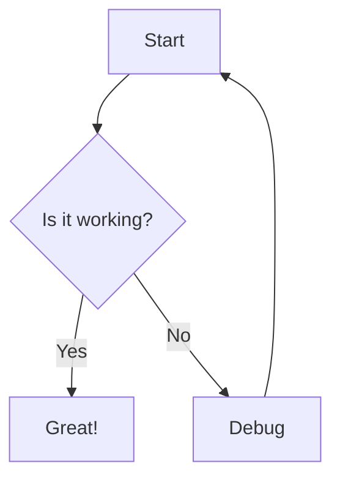

# Markview

A modern desktop Markdown editor and vault manager for macOS and Windows. Built with **Tauri v2 + React + TypeScript + Tailwind CSS**.

## Features

- 🗂️ **Vault Mode** — Open a folder as your markdown workspace
- 📁 **Folder Tree** — Recursive collapsible sidebar with file navigation
- 📑 **Multi-Tab** — Open multiple files in tabs with unsaved-change indicators
- ⚡ **Quick Switcher** — `Cmd+P` fuzzy file search across the vault
- ✂️ **Split-Pane** — Live editor ↔ preview with draggable resizer
- 📝 **Live Preview** — GFM-rendered markdown with syntax highlighting
- 🧮 **Math (KaTeX)** — Inline `$...$` and block `$$...$$` LaTeX math rendering
- 📊 **Diagrams (Mermaid)** — Flowcharts, sequence diagrams, and more
- 🔗 **WikiLinks** — Obsidian-style `[[Note Name]]` internal links
- 🖼️ **Local Images** — Relative image paths resolved against the current note
- 🌙 **Dark Mode** — Toggle between light and dark themes
- 🖥️ **Native** — Desktop app using native WebKit/WebView2

## Tech Stack

| Layer | Technology |
|-------|------------|
| Desktop Shell | Tauri v2 (Rust) |
| Frontend | React 19 + TypeScript + Vite |
| Styling | Tailwind CSS v3 |
| Editor | CodeMirror 6 + `@codemirror/lang-markdown` |
| Renderer | `react-markdown` + `remark-gfm` + `remark-math` |
| Math | KaTeX (`rehype-katex`) |
| Diagrams | Mermaid 11 |
| State | Zustand |
| Panels | `react-resizable-panels` |

## Markdown Syntax Examples

Markview supports standard Markdown plus the extensions below.

### KaTeX Math

**Inline math:**

```markdown
The energy is $E = mc^2$ where $c$ is the speed of light.
```

**Block math:**

```markdown
$$
\sum_{i=1}^{n} x_i = \frac{1}{n} \sum_{i=1}^{n} x_i
$$
```

### Mermaid Diagrams

Use a fenced code block with the `mermaid` language tag:

```markdown

```

Other supported diagram types: `flowchart`, `sequenceDiagram`, `classDiagram`, `stateDiagram`, `erDiagram`, `journey`, `gantt`, `pie`, `requirementDiagram`.

### WikiLinks

Obsidian-style internal links are rendered as vault-relative links:

```markdown
See also [[Another Note]] for more details.
```

### Local Images

Images are resolved relative to the current markdown file:

```markdown

```

Relative paths (e.g., `assets/screenshot.png`) are resolved against the directory containing the open markdown file. Absolute paths and `https://` URLs pass through unchanged.

### Standard Markdown

All standard GitHub-Flavored Markdown is supported:

```markdown
# Heading 1
## Heading 2

**Bold**, *italic*, ~~strikethrough~~

- Bullet list
- [ ] Task list (unchecked)
- [x] Task list (checked)

| Table | Column |
|-------|--------|
| A1    | B1     |
| A2    | B2     |

> Blockquote

`inline code`

```python
# fenced code block
def hello():
    return "world"
```
```

## Keyboard Shortcuts

| Shortcut | Action |
|----------|--------|
| `Cmd+P` / `Ctrl+P` | Quick Switcher — fuzzy find files |
| `Cmd+S` / `Ctrl+S` | Save current file |

## Development

### Prerequisites
- [Rust](https://rustup.rs/)
- [Node.js](https://nodejs.org/) (v18+)

### Setup

```bash
# Install dependencies
npm install

# Run in development mode (launches Tauri window)
npm run tauri dev
```

### Build

```bash
# Build for production
npm run tauri build
```

## Roadmap

See the full [Product Plan](.hermes/plans/2026-06-19_markdown-viewer-editor-plan.md) for build phases.

| Phase | Status | Description |
|-------|--------|-------------|
| 0: Bootstrap | ✅ | Vite + Tauri scaffold, build pipelines |
| 1: Core Shell & File I/O | ✅ | Vault picker, read/write, dark mode |
| 2: Live Split-Pane Preview | ✅ | CodeMirror editor + GFM live preview |
| 3: Sidebar & Tabs | ✅ | Folder tree, multi-tab, quick switcher |
| 4: Markdown Enhancements | ✅ | KaTeX, Mermaid, WikiLinks, images |
| 5: PDF Export, Settings, Polish | ⏳ | PDF export, global search, settings |
| 6: Distribution | ⏳ | Auto-updater, code signing |

## License

MIT
